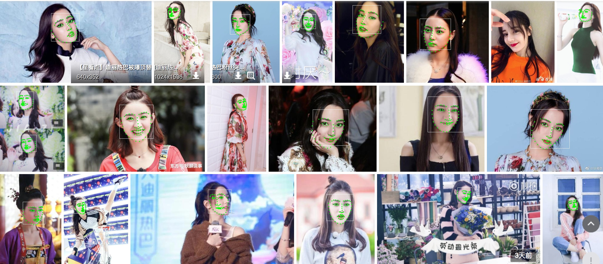

### 实时人脸68关键点检测 for Mac/iOS

### 详细的代码说明见[博客](https://wxjwjj.github.io/2018/05/04/reallandmark/)

#### 算法思想：


#### 实时视频人脸关键点检测：


#### 图片多人脸关键点检测：



#### 调用方式
```bash
# clone该工程
cd Video_Face
mkdir build
cd build
cmake ..
make # 即可在build文件夹中生成可执行程序，调用方式见[博客](https://wxjwjj.github.io/2018/05/04/reallandmark/)
```

PS：`dlib`、`Seetaface`的相关代码我也一起打包到工程中了，如果你自己编译安装了OpenCV，用上述CMakeLists.txt便可以。如果你没有编译OpenCV，恰巧又是Mac平台，可以使用我编译好的OpenCV动态库，就在`libs`文件夹内，OpenCV头文件在`include`文件夹。

### Ref:
[Face detect模块采用山世光老师开源的seetaface](https://github.com/seetaface/SeetaFaceEngine)
&nbsp;
[Facial Landmark模块采用了dlib库](https://github.com/davisking/dlib)
# Facial-Landmark
